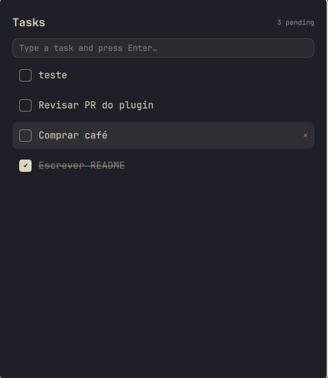

# Simple Task

A dead-simple task list for [Omarchy](https://omarchy.org/): an overlay plugin
for the Omarchy shell, styled with whatever theme you have active. No webapp,
no separate window, no account. Type a task, hit Enter, check it off.



## Install

```bash
omarchy plugin add https://github.com/PMota173/simple-task-omarchy.git --enable
```

This clones the plugin into `~/.config/omarchy/plugins/pedro.simple-task/`
and registers it in `~/.config/omarchy/shell.json`.

## Bind a key to it

Simple Task is an overlay, summoned like Omarchy's built-in Clipboard manager
or Reminders. Add a binding in `~/.config/hypr/bindings.lua`:

```lua
o.bind("SUPER + SHIFT + T", "Simple Task", "omarchy-shell shell toggle pedro.simple-task")
```

Pick whatever key combo is free on your setup, check with
`omarchy menu keybindings --print` first.

## Using it

- Type anything and press **Enter** to add it as a task
- **↑ / ↓** to move the selection
- **Enter** (with nothing typed) checks/unchecks the selected task
- **Delete** removes the selected task
- **Shift+Delete** clears every completed task (asks to confirm)
- **Esc** clears what you're typing, or closes the overlay if the input is empty

Completed tasks drop to the bottom of the list, struck through. Everything
is saved to `~/.local/state/omarchy/tasks.json` as you go, so it survives
restarts.

## Theming

Colors are pulled straight from the active Omarchy theme (`Color.menu.*` for
the card, `Color.popups.border` for the border, the same accent color
Hyprland uses for active window borders), so it re-themes itself automatically
whenever you switch themes with `omarchy theme set`.

## Uninstall

```bash
omarchy plugin remove pedro.simple-task
```

This removes the plugin folder and un-registers it from
`~/.config/omarchy/shell.json`. If you added a keybinding for it, remove that
line from `~/.config/hypr/bindings.lua` too. Your saved tasks stay at
`~/.local/state/omarchy/tasks.json` in case you reinstall later; delete that
file yourself if you want them gone for good.

## License

MIT
